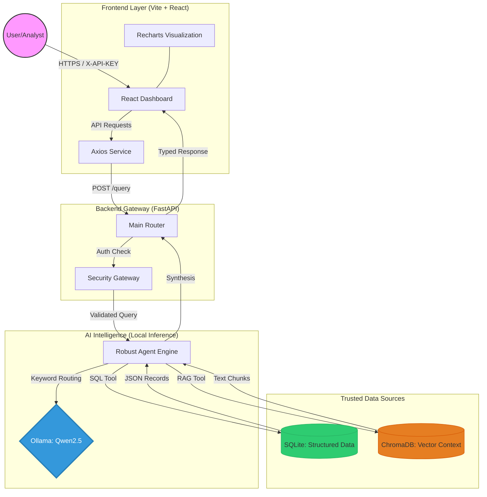
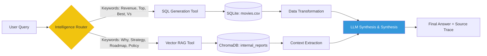
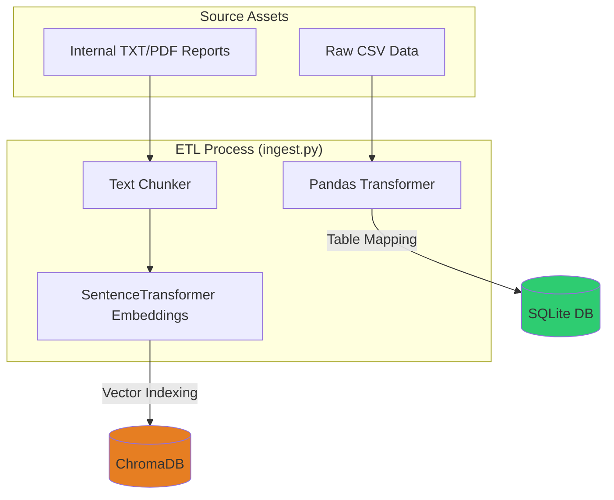

# 🏗️ System Architecture: InsightFlow AI

This document provides a detailed technical overview of the InsightFlow AI platform, focusing on the data flow, component interactions, and the "Secure AI" orchestration layer.

---

## 1. High-Level System Architecture (HLD)

The system is designed as a secure, decoupled micro-architecture where the AI model is isolated within a local boundary to ensure zero data leakage.

---

## 2. Intelligence Logic & Routing Flow

InsightFlow uses a **Deterministic Routing Engine** to minimize hallucinations and ensure that the most accurate data source is selected for every user query.

---

## 3. Data Ingestion Pipeline (ETL)

The ingestion pipeline transforms raw business assets into queryable intelligence stores.

---

## 4. Security Framework
1.  **Isolation**: The LLM (Ollama) runs entirely on the host machine; no data is transmitted to external endpoints.
2.  **Tool-Based Access**: The LLM never writes directly to the database. It only generates queries that are executed by a validated Python wrapper.
3.  **Audit Trail**: Every interaction is logged with the specific "Tool" used, ensuring transparency in AI decision-making.
