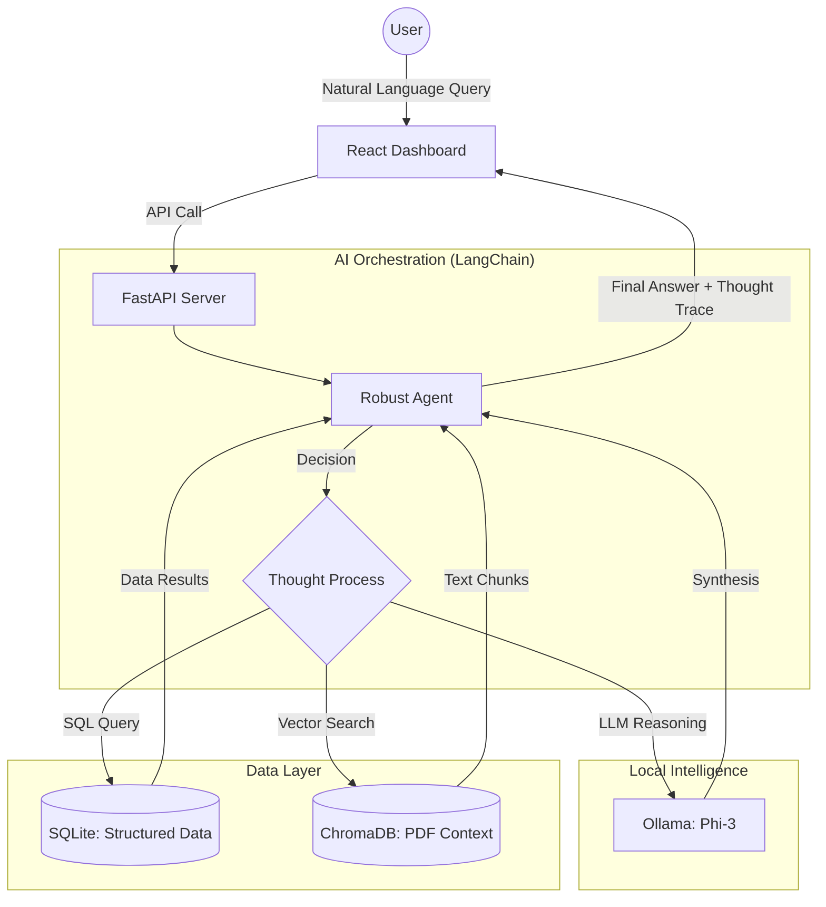
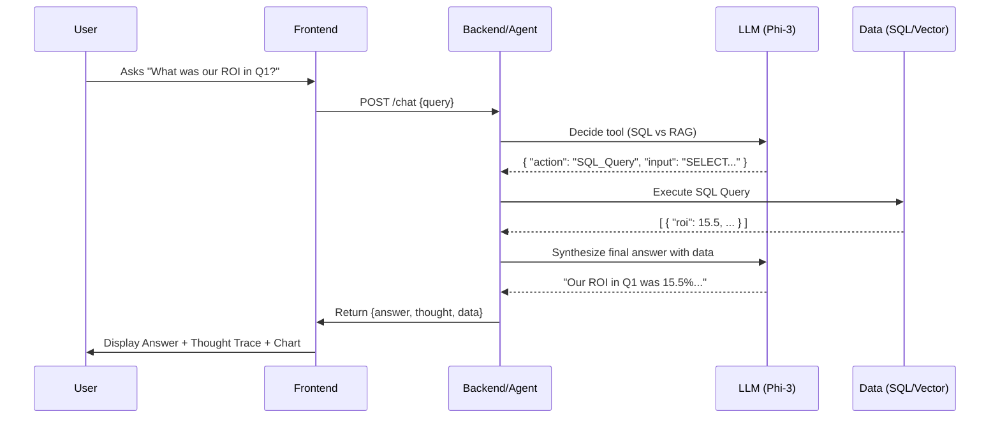

# InsightFlow: Secure AI Insights Assistant

InsightFlow is a production-grade AI-powered business intelligence platform. It leverages Large Language Models (LLMs) to provide real-time insights from both structured data (SQL/CSV) and unstructured data (PDFs) through a unified chat interface and dynamic dashboard.

## 🏗️ Architecture

The system follows a modern decoupled architecture:

### 1. High-Level Design (HLD)
- **Frontend (UI/UX)**: A responsive React application providing a premium dashboard and a natural language chat interface.
- **Backend (API)**: A FastAPI server that orchestrates the AI logic, data retrieval, and agent execution.
- **AI Orchestration**: LangChain-based Agent Executor that chooses between SQL querying and Vector Search (RAG) based on the user's intent.
- **Local LLM**: Ollama running the **Qwen2.5 (0.5B)** model, ensuring data privacy and local execution.



### 2. Low-Level Design (LLD)
- **Structured Data Layer**: CSV files are ingested into a **SQLite** database. The system handles tables such as `marketing_spend`, `movies`, `viewers`, and `watch_activity`.
- **Unstructured Data Layer**: PDF reports are processed using `pypdf`, chunked with `RecursiveCharacterTextSplitter`, and stored in **ChromaDB** (Vector Database) using `SentenceTransformers` (`all-MiniLM-L6-v2`) embeddings.
- **Agentic Workflow (RobustAgent)**:
    - The system uses a custom JSON-based reasoning loop.
    - **SQL Tool**: Executes cleaned SQL queries against SQLite.
    - **RAG Tool**: Performs semantic similarity searches in ChromaDB.
    - **Logic**: The agent (Phi-3) outputs a JSON structure containing `thought`, `action`, and `action_input` to decide how to fetch data before synthesizing a final response.

### 3. Request Flow Diagram


---

## 🛠️ Tech Stack
- **Frontend**: React, Tailwind CSS, Lucide Icons, Recharts.
- **Backend**: Python, FastAPI, LangChain.
- **Databases**: SQLite (Structured), ChromaDB (Vector/Unstructured).
- **LLM**: Ollama (Phi-3).
- **DevOps**: Pip, NPM.

---

## 🚀 Getting Started

### Prerequisites
- **Python 3.10+**
- **Node.js & NPM**
- **Ollama** (Download from [ollama.com](https://ollama.com))

### Step 1: Setup the LLM
1. Install Ollama.
2. Pull the Qwen2.5 model:
   ```bash
   ollama pull qwen2.5:0.5b
   ```

### Step 2: Backend Setup
1. Navigate to the project root.
2. Install dependencies:
   ```bash
   pip install -r backend/requirements.txt
   ```
3. (Optional) Install additional tools for PDF processing:
   ```bash
   pip install pypdf sentence-transformers
   ```

### Step 3: Data Ingestion
Before running the app, you need to populate the databases:
```bash
python scripts/ingest.py
```
This will:
- Load all CSVs from `data/raw_csv` into `insights_assistant.db`.
- Index all PDFs from `data/raw_pdf` into the ChromaDB vector store.

### Step 4: Run the Backend
```bash
python run_backend.py
```
The backend will start at `http://localhost:8000`.

### Step 5: Frontend Setup
1. Navigate to the frontend directory:
   ```bash
   cd frontend
   ```
2. Install dependencies:
   ```bash
   npm install
   ```
3. Start the development server:
   ```bash
   npm run dev
   ```
The frontend will be available at `http://localhost:5173`.

---

## 💡 How to Use
1. **Chat Interface**: Ask natural language questions like:
   - *"What was the total marketing spend in Q1?"* (Triggers SQL Tool)
   - *"What are the key takeaways from the latest internal report?"* (Triggers RAG Tool)
   - *"Compare our ROI across different channels."*
2. **Thought Trace**: The UI displays the AI's reasoning process, showing how it selected tools and interpreted data.
3. **Insights Dashboard**: View visualized data trends and metrics automatically extracted from the system.

## 🧠 Assumptions & Tradeoffs

### Assumptions
- **Local Execution**: Assumed the reviewer has Ollama installed with the `qwen2.5:0.5b` model.
- **Data Format**: Assumed CSV dates follow `YYYY-MM-DD` format for SQLite parsing.
- **Model Choice**: Selected Qwen2.5 (0.5B) for ultra-fast local intelligence on standard hardware.

### Tradeoffs
- **Synchronous Execution**: The backend currently waits for the full LLM response before returning. While streaming improves perceived speed, synchronous was chosen for easier data-handling in the charts.
- **Local Embeddings**: Using `all-MiniLM-L6-v2` locally avoids API costs/latency but may be less nuanced than high-end cloud embeddings (like OpenAI).
- **JSON Enforcement**: Using a strict JSON-based agent loop instead of LangChain's built-in agents to ensure higher reliability on smaller models like Phi-3.

## 📁 Project Structure
```text
├── backend/
│   ├── core/           # Agent logic & LLM configuration
│   ├── db/             # Database connection utilities
│   ├── main.py         # FastAPI routes
│   └── requirements.txt
├── data/
│   ├── raw_csv/        # Source CSV data
│   ├── raw_pdf/        # Source PDF reports
│   └── chroma_db/      # Vector database storage
├── frontend/           # React + Tailwind source code
├── scripts/
│   └── ingest.py       # Data pipeline script
└── run_backend.py      # Entry point for backend
```
