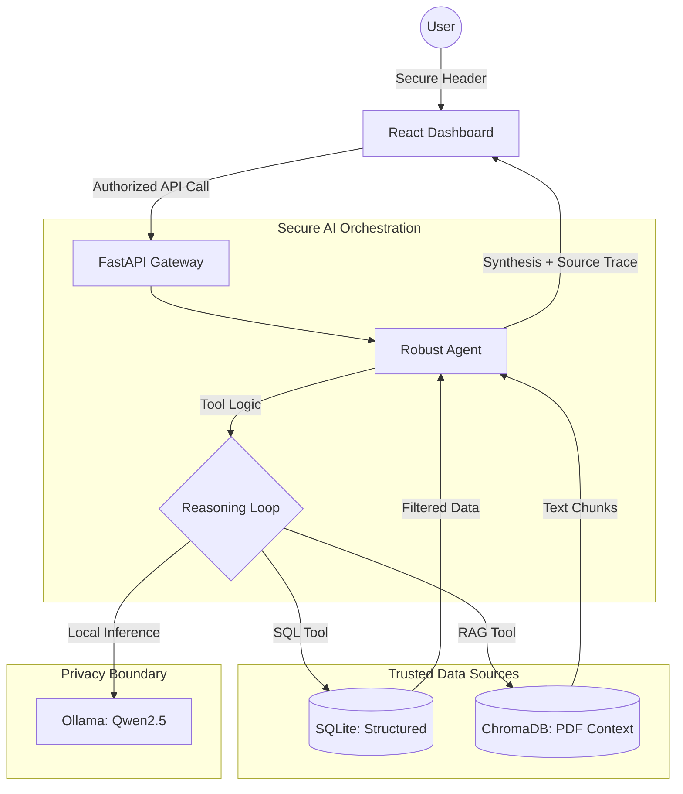

# InsightFlow: Secure AI Insights Assistant

InsightFlow is a production-grade, secure AI-powered business intelligence platform designed for entertainment industry analytics. It combines structured data (SQL), unstructured internal reports (PDF), and business spreadsheets (CSV) into a unified intelligence layer.

## 🏗️ Architecture Overview

The system follows a modern decoupled architecture optimized for **security**, **privacy**, and **explainability**.

### 1. High-Level Design (HLD)
- **Frontend**: A premium React application built with Tailwind CSS, featuring a real-time dashboard and a tool-tracing chat interface.
- **Backend**: A FastAPI server that implements a "Security First" gateway, restricting raw data access through specialized AI tools.
- **AI Intelligence**: Powered by **Ollama (Qwen2.5:0.5b)**. Running the model locally ensures that sensitive internal data never leaves the organizational perimeter.



---

## 🛡️ Security & Privacy Thinking

The platform was built with strict adherence to security requirements:
1.  **Local Execution (Zero Data Leakage)**: By using Ollama and local embedding models (`all-MiniLM-L6-v2`), no business data is sent to external APIs (OpenAI/Anthropic).
2.  **Tool-Based Access Control**: The AI Agent does not have direct read/write access to the database files. It operates through specific backend functions (Tools), ensuring a layer of validation between the LLM and the data.
3.  **API Security**: All backend requests require a valid `X-API-KEY` header (Demonstrated via `sk-insight-flow-2025`).
4.  **Auditability**: Every query and agent decision is logged with a timestamp and "Thought Trace" for explainability.

---

## 🚀 Deployment (Containerized)

The project is fully containerized using Docker for production-ready deployment.

### Prerequisites
- Docker & Docker Compose
- Ollama (installed locally on host)

### Quick Start
1. **Pull the Model**:
   ```bash
   ollama pull qwen2.5:0.5b
   ```
2. **Launch the Stack**:
   ```bash
   docker-compose up --build
   ```
3. **Access**:
   - Frontend: `http://localhost:80`
   - Backend API: `http://localhost:8000`

---

## 💡 Functional Capabilities

The assistant is capable of answering complex business questions such as:
- *"Which titles performed best in 2025?"* (SQL Tool)
- *"Why is Stellar Run trending recently?"* (RAG Tool + Review Data)
- *"Compare Dark Orbit vs Last Kingdom."* (Cross-source analysis)
- *"What audience segments are most engaged?"* (Demographic analysis)

### Tool Trace & Explainability
The UI includes a **"Agent Logic Flow"** accordion for every response, showing the raw reasoning, the tool selected (SQL vs PDF), and the data retrieved before the final synthesis.

---

## 📂 Project Structure
```text
├── backend/
│   ├── core/           # Agent reasoning & LLM logic
│   ├── main.py         # FastAPI Gateway & Security
│   ├── Dockerfile      # Backend containerization
│   └── requirements.txt
├── frontend/
│   ├── src/            # React + Recharts + Tailwind
│   ├── Dockerfile      # Frontend/Nginx containerization
│   └── ...
├── data/
│   ├── raw_csv/        # Source business data
│   ├── raw_pdf/        # Internal reports
│   └── chroma_db/      # Vector database
├── scripts/
│   └── ingest.py       # Data pipeline (ETL)
└── docker-compose.yml   # Full-stack orchestration
```

---

## 🧠 Assumptions & Tradeoffs
- **Local Embeddings**: Used `all-MiniLM-L6-v2` for speed and zero cost. While less powerful than Ada-002, it provides sufficient precision for document retrieval.
- **SQLite vs Postgres**: SQLite was chosen for this assessment for portability and ease of setup, though the `sqlalchemy` implementation allows for easy migration to Postgres.
- **Model Choice**: Qwen2.5 (0.5B) was selected for its exceptional instruction-following capability in a small footprint, ideal for local execution on standard hardware.

---
**Developed by [Shubham Savarn]** - *Strategic Systems for Intelligent Insights.*
